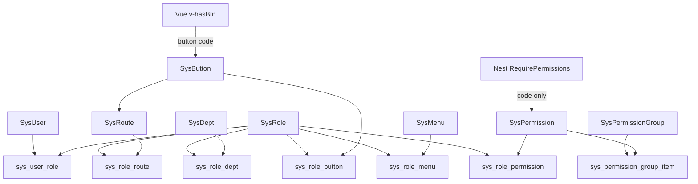
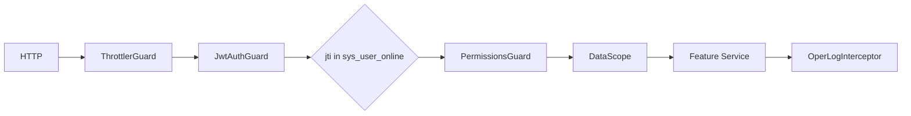

# 若依内置功能迁移到 NestJS 的扩展计划

## 范围与原则

**做：** 用户/部门/岗位/菜单/路由/按钮/角色（含数据权限）、独立权限与权限组、字典、参数、通知公告、操作日志、登录日志、在线用户、定时任务、服务监控、连接池监视，以及登录验证码、个人中心、本地上传、Excel 导入导出、可选注册。

**不做：** 代码生成、在线构建器、系统接口文档；不做前端管理页（本计划只动 [`apps/server`](apps/server) + [`packages/shared`](packages/shared) + 必要的 [`packages/config`](packages/config)）。现有 [`apps/web`](apps/web) 的 `ADMIN`/`USER` 用户页会暂时对不上新 API，前端另开一期。缓存监控可在 Redis 落地后另开，本计划不强制同期交付。

**沿用当前骨架，不抄 Java 工程形态：**

- 仍是 `controller → service → repository → entity`，契约在 `@fullstack-scaffold/shared`，DTO 用 `createZodDto`，全局 `{ code: 0, data }` / JWT / `api/v1` / Swagger。
- 不建 `ruoyi-admin` / `ruoyi-framework` 那种多模块；不搬 `AjaxResult`、Shiro、MD5+salt、Thymeleaf、Druid 页面、Quartz 的 `QRTZ_*` 表。
- 业务规则、数据范围、字典/参数/日志等尽量对齐若依原版 [`ry_20260319.sql`](https://github.com/yangzongzhuan/RuoYi/blob/springboot3/sql/ry_20260319.sql)。
- **功能权限不沿用「菜单即权限」**：不把 `perms` 写在菜单上，不把 `F` 当权限。接口鉴权只认 permission；菜单/路由/按钮只表达「这个角色看不看得见」，经角色关联，不直接绑 permission。

必要的 NestJS 适配（否则无法在当前栈落地）：

| 若依原版 | 本项目适配 |
| --- | --- |
| Shiro Session + `sys_user_online` | 仍发 JWT，但签发 `jti`，在 `sys_user_online` 登记会话（亦可辅以 Redis） |
| MD5 + salt | 继续 bcrypt，`password` 列加长到 255，去掉 `salt` |
| 菜单 `perms` + 类型 `F` 当权限 | 独立 `sys_permission`；接口按 permission code 鉴权；按钮建表并只绑角色 |
| Thymeleaf `url` 菜单兼任路由 | `sys_menu` 只管侧栏；`sys_route` 管前端路由；`sys_button` 挂在路由上 |
| 角色勾选菜单树 = 授权 | 角色分两块：permission（能不能调接口）+ 菜单/路由/按钮（界面看见什么） |
| `invokeTarget` 任意 Spring Bean | 白名单 Job Registry，禁止字符串反射（避开若依历史 RCE） |
| Druid 控制台 | 读 mysql2 连接池指标的 JSON 接口；SQLite 返回不可用 |
| `user_id=1` / `role_key=admin` 超管 | 原样保留 |

## RBAC（相对若依的核心偏离）

拆成两层，都挂在角色上，但职责不同：

```
用户 ── 角色 ── 权限          ← 能力：接口能不能调
         ├── 菜单 / 路由 / 按钮  ← 可见性：界面显不显示
         └── 权限组（仅分组展示，不是鉴权单位）
```

**接口必须对 permission，不要对角色。** 角色是组织身份（会增删改名），permission code 才是稳定的能力名。`@RequirePermissions('system:user:list')` 写进代码后，新角色只要在后台勾上该 permission 就能调接口，不用改守卫。

菜单/路由/按钮对角色，是为了让「看得见」和「能调用」可以分开配：同一套 permission，不同角色可以有不同侧栏和按钮；也可以只给接口权、不上菜单（给脚本/对接用）。

**按钮建表，只和角色关联。** `sys_button` 挂在某条路由下，`sys_role_button` 决定谁看见。前端用 `v-hasBtn="'user.remove'"`（以 `/auth/me` 下发的 button code 为准），不要用 `v-role`（角色 key 写进模板），也不要用 `v-permission` 兼按钮显隐（那会绕过角色-按钮配置）。



| 对象 | 表 | 职责 | 关联 |
| --- | --- | --- | --- |
| permission | `sys_permission` | 原子能力，code 如 `system:user:list` | 角色通过 `sys_role_permission` 绑定；**接口只认它** |
| permission_group | `sys_permission_group` + `sys_permission_group_item` | 后台勾选分组，如「用户管理」 | 包含多个 permission；**角色不绑组** |
| role | `sys_role` | 身份打包；另带 `data_scope` | 同时绑 permission（能力）和 menu/route/button（界面） |
| menu | `sys_menu` + `sys_role_menu` | 侧栏树（目录/链接/外链、图标、排序） | **只绑角色**，无 `permission_id` |
| route | `sys_route` + `sys_role_route` | 前端路由（path/component/缓存；含隐藏详情页） | **只绑角色** |
| button | `sys_button` + `sys_role_button` | 某条路由上的操作控件 | 归属 `route_id`；**只绑角色**；前端按角色下发的 button code 显隐 |
| API | 不建表 | HTTP 接口 | `@RequirePermissions('system:user:remove')` |

约束：

- 角色配置界面分两块：**功能权限**（permission，组仅辅助全选）和 **界面可见性**（菜单树 / 路由 / 按钮）。勾组只写入 `sys_role_permission`，不会自动改菜单或按钮。
- **不做** 菜单/路由/按钮与 permission 的直接外键。
- **不做** 接口与角色的绑定，也不做运行时「路径 → 权限」登记表。
- 两层允许短暂不一致：有按钮无 permission → 点了 403；有 permission 无按钮/菜单 → 接口可用但界面没有。种子数据应对齐，管理端可做提示，运行时不强行同步。
- 菜单与路由必须拆开：详情页 `/system/users/:id` 走 route 且不上侧栏。
- 数据权限（部门范围）保持独立，不塞进 permission 表。
- 超管（`user_id=1` 或 `role_key=admin`）跳过 permission、界面过滤与数据范围。
- 种子：permission 行 + 角色权限；另写 `sys_role_menu` / `sys_role_route` / `sys_role_button`（普通角色按产品需要配，超管不必逐条）。

## 目标模块与路由

保持 `api/v1` 前缀，按若依域分组，REST 风格（复数资源，不用 `/system/user/list` 这种 MVC 路径）：

```
apps/server/src/modules/
  auth/                 # 登录/注销/验证码/注册、getInfo
  profile/              # 个人资料、改密、头像
  system/
    users/              # 现有 users 迁入并扩成 sys_user
    roles/ depts/ posts/ menus/ routes/ buttons/
    permissions/        # permission + permission_group
    dicts/ configs/ notices/
  monitor/
    oper-logs/ login-logs/ online/ server/ datasource/ jobs/
  files/                # 本地上传/下载
```



核心路径示例：

- `POST /auth/login`、`POST /auth/logout`、`GET /auth/me`（用户 + roles + permission codes + 该角色菜单树/路由/按钮）
- `GET /auth/captcha`、`POST /auth/register`（受 `sys.account.registerUser` 控制）
- `/system/users|roles|menus|routes|buttons|permissions|depts|posts|dicts|configs|notices`
- `/monitor/oper-logs|login-logs|online|jobs|server|datasource`

## 数据模型

新迁移替换现有 [`user`](apps/server/src/modules/users/user.entity.ts) 表。实体仍 `defineEntity` + 在 [`entities/index.ts`](apps/server/src/entities/index.ts) 登记；MySQL/SQLite 双方言 SQL（与现有迁移同一套路）。

**建表（跳过 `gen_*`；恢复角色-界面关联，但不用它给接口鉴权）：**

- 组织与账号：`sys_dept`、`sys_user`、`sys_post`、`sys_role`、`sys_user_role`、`sys_user_post`、`sys_role_dept`
- 功能权限：`sys_permission`、`sys_permission_group`、`sys_permission_group_item`、`sys_role_permission`
- 界面可见性：`sys_menu`、`sys_role_menu`、`sys_route`、`sys_role_route`、`sys_button`、`sys_role_button`（菜单无 `perms`、无类型 `F`）
- 其余对齐若依：`sys_oper_log`、`sys_dict_type`、`sys_dict_data`、`sys_config`、`sys_logininfor`、`sys_user_online`、`sys_job`、`sys_job_log`、`sys_notice`、`sys_notice_read`

**字段约定：**

- 用户等业务列名仍用若依原名（`login_name`、`user_name`、`phonenumber`、`del_flag`…）；TS 属性用驼峰（`loginName`、`userName`）。
- 登录 DTO 仍收 `username`，服务端映射到 `loginName`。
- 状态继续用若依 `'0'`/`'1'` 字符串（对接字典 `sys_normal_disable`），不再用当前 `enabled: boolean`。
- 审计字段抽公共 mixin：`createBy` / `createTime` / `updateBy` / `updateTime` / `remark`。
- `sys_permission.code` 唯一，形如 `system:user:list`。`sys_menu` / `sys_route` / `sys_button` **没有** `permission_id`。
- `sys_button` 归属 `route_id`，带稳定 `code`（如 `user.remove`）供前端 `v-hasBtn` 显隐；该 code 不等于接口 permission。
- `sys_user.user_id=1` 与 `role_key=admin` 视为超管；种子用户 `admin` 密码改为 bcrypt，默认仍 `admin123456`。

菜单/路由/按钮种子**去掉**：代码生成、表单构建、系统接口；缓存监控可暂不建菜单。保留系统管理全套 + 日志 + 在线用户 + 定时任务 + 数据监控（连接池）+ 服务监控。权限种子覆盖这些模块对应的 list/add/edit/remove/export 等 code。

[`scripts/seed.ts`](apps/server/scripts/seed.ts) 改为：跑迁移 + 幂等写入初始化数据（部门树、权限与权限组、角色权限、角色菜单/路由/按钮、字典、参数、默认任务、公告）。

## 横切能力（先于业务模块）

这些放在现有 [`src/common`](apps/server/src/common)，替换/扩展现在的粗粒度角色模型：

1. **权限码：** `@RequirePermissions('system:user:list')` 只查当前用户的 permission code 集合（来自 `sys_role_permission`，超管放行；多权限默认 AND）。现有 `@Roles('ADMIN')` / [`roles.ts`](packages/shared/src/roles.ts) 的 `ADMIN`/`USER` 删除。守卫不读菜单、路由、按钮、权限组。
2. **登录用户：** `AuthUser` 扩为 `userId, loginName, userName, deptId, roles, permissions, dataScope`。`JwtAuthGuard` 校验 JWT 后还要查 `sys_user_online.sessionId === jti`，并按库中最新 `status`/`del_flag` 拒绝停用用户。
3. **数据权限：** 对齐若依 `DataScope`（1 全部 / 2 自定义 `sys_role_dept` / 3 本部门 / 4 本部门及以下 `ancestors` / 5 仅本人）。在 repository 用 QueryBuilder 条件拼接，**禁止**字符串拼 SQL。与功能权限正交。
4. **操作日志：** `@OperLog({ title, businessType })` + 拦截器写 `sys_oper_log`（异步，失败不影响主请求）；敏感字段脱敏。
5. **登录日志：** 成功/失败都写 `sys_logininfor`；UA 解析浏览器/OS；登录地点可先空字符串。
6. **验证码与重试：** 优先 Redis TTL（项目已接入 `REDIS_URL`）；验证码 UUID；密码错误次数按账号锁定，登录日志提供解锁接口。IP 黑名单读 `sys.login.blackIPList`。
7. **参数缓存：** 可用 Redis，增删改刷新；`sys.user.initPassword`、密码策略、注册开关从 `sys_config` 读，不写死。

## 分阶段交付

### 阶段 0 — 地基

公共 mixin、权限装饰器/守卫、操作日志拦截器、数据权限助手、`sys_user_online` 会话登记、验证码服务、文件本地存储配置（`packages/config` 增加 `upload.dir`）。一条大迁移创建全部 `sys_*` 表并 drop 旧 `user`。

### 阶段 1 — RBAC 核心（可独立验收）

权限与权限组 CRUD；菜单/路由/按钮 CRUD；角色分两块保存（permission + 菜单/路由/按钮 + 数据范围）；部门/岗位；用户（部门/岗位/角色、重置密码、状态、数据权限过滤列表）。

登录签发带 `jti` 的 JWT 并写入在线表；`GET /auth/me` 返回 permission codes（给接口守卫）、以及按角色过滤的菜单树/路由/按钮（给前端渲染，按钮用 `v-hasBtn`）；个人中心改资料/密码/头像。

业务规则：不能改超管、不能删自己、停用部门不可选、菜单/路由父子校验、角色已分配用户不可删、删除 permission 前检查是否被角色引用、删除菜单/路由/按钮前检查是否被角色引用。

### 阶段 2 — 配置类

字典类型/数据、参数、通知公告（含已读）。提供 `GET /system/dicts/:dictType` 给前端下拉。Excel 导出（用户/角色/字典等）用 `exceljs` + `@SkipTransform()`。

### 阶段 3 — 审计与会话

操作日志、登录日志（查询/删除/清空/导出/解锁）。在线用户列表与强退（删 `sys_user_online` 行即让 JWT 失效）。

### 阶段 4 — 监控

- **服务监控：** CPU/内存/JVM 对应 Node `os` + `process.memoryUsage` + 磁盘 + 运行时信息，JSON 对齐若依 `Server` 分组（cpu/mem/sys/jvm 改为 runtime）。
- **连接池：** 从 MikroORM 底层 mysql2 pool 读 total/idle/queue；SQLite 明确返回不支持。

### 阶段 5 — 定时任务

只建 `sys_job` / `sys_job_log`，**不建** `QRTZ_*`。`@nestjs/schedule` + cron 解析；`invoke_target` 仅允许注册表内的 `bean.method(args)`（内置 `ryTask.ryNoParams` 等示例）。支持启动/暂停/立即执行/ misfire 策略的简化版；并发开关用任务级锁。默认三条示例任务保持暂停。

### 阶段 6 — 收尾

用户 Excel 导入、注册开关、初始化密码策略在登录响应里给提示字段（`GET /auth/me` 增加 `isDefaultModifyPwd` / `isPasswordExpired`，供后续前端弹窗）。更新 README 新增模块清单；现有 web 登录若字段变更则做最小适配（仍用 `username`）。

## 对现有代码的破坏性变化

- [`UserEntity.role`](apps/server/src/modules/users/user.entity.ts) / [`USER_ROLES`](packages/shared/src/roles.ts) / [`RolesGuard`](apps/server/src/common/guards/roles.guard.ts) 被 permission code + 多角色替代。
- [`GET /users`](apps/server/src/modules/users/user.controller.ts) 迁到 `/system/users`，视图字段变为若依用户模型。
- JWT payload 去掉单一 `role`，增加 `jti`；注销变为服务端失效。
- 旧 `user` 表数据不迁移（脚手架几乎只有 seed admin）。

## 依赖增量（server）

`exceljs`、`svg-captcha`、`@nestjs/schedule`、cron 解析库、`ua-parser-js`（登录日志）；上传用 Nest 已有 multer 即可。Redis 客户端沿用已接入的 `REDIS_URL`。不加 Quartz。

## 验收要点（Swagger / curl）

- admin 拥有全部 permission 与全部菜单/路由/按钮；普通角色的接口权看 `sys_role_permission`，侧栏/路由/按钮看对应角色关联表，用户列表另受数据范围限制。
- 无某 permission 的账号调用对应接口 → 403，即使角色勾了相关按钮。
- 角色只勾了 permission、未勾菜单/按钮 → 接口可通，`/auth/me` 不含该项。
- 勾选权限组「用户管理」后，角色实际写入的是组内各 permission 行，而不是 group id，也不会自动写入菜单或按钮。
- 守卫装饰器只出现 permission code，不出现角色 key。
- 停用用户、强退、注销后令牌立即 401。
- 验证码错误、IP 黑名单、密码锁定可复现。
- 操作写 `sys_oper_log`，登录写 `sys_logininfor`。
- 任务只能调用白名单；非法 `invoke_target` 被拒绝。
- MySQL 下连接池接口有数据；SQLite 下有明确不支持响应。
